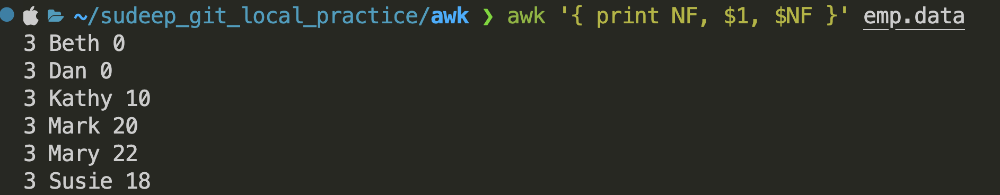

# Introduction
The basic operation of Awk is to scan a sequence of input lines, from any number of files, one after another, searching for lines that are matched by any of the patterns in the program. The precise meaning of “match” depends on the pattern in ques
```sh
awk '$3 == 0 { print $1 }' file1 file2
$ awk '$3 == 0 { print $1 }'

awk -f progfile  optional list of input files
awk '{ print }' emp.data is same as awk '{ print $0 }' emp.data
```

Awk counts the number of fields in the current input line and stores the count in a built-in variable called NF


####  NF, the Number of Fields
```sh
awk '{ print NF, $1, $NF }' emp.data # wNF, the Number of Fields

awk '{ print NR,  NF, $1, $NF }' emp.data  # prints the number of fields and the first and last fields of each input line.

awk '{ print "total pay of emp is", $1, "is", $2 * $3 }' emp.data  # Putting Text in the Output

awk -f first.awk emp.data 
awk '{ printf("Total Pay of %s is %f\n"), $1, $3 }' emp.data  

awk '{ printf("Total Pay of %s is %.2f\n"), $1, $3 }' emp.data 

awk '{ printf("Total Pay of %-8s is %.2f\n", $1, $2 * $3) }' emp.data

awk '{ printf("Total Pay of %-8s is %6.2f\n", $1, $2 * $3) }' emp.data 

awk '{ printf("Total Pay of %-8s is %6.2f\n", $1, $2 * $3) }' emp.data | sort -r # Sorting
```

# Selection
```sh
$1 == "Susie"
$2 >= 20 
$2 * $3 > 200 
$2 >= 20 || $3 >= 20
$2 >= 20 && $3 >= 20
$2 >= 20 ! $3 >= 20
!($2 < 20 && $3 < 20)

```
# Data Validation


